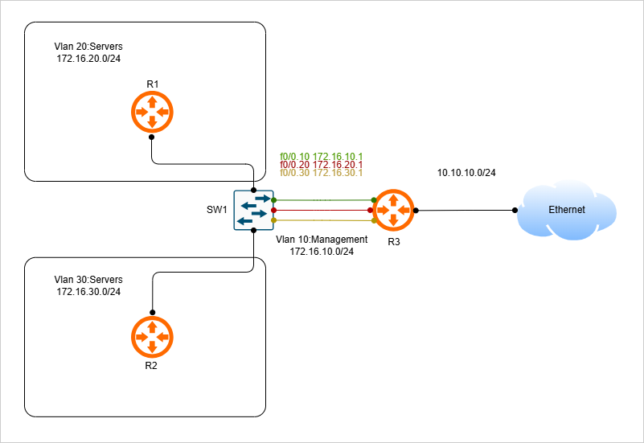

# home-system-boogie

This project is designed to practice my networking and cloud knowledge by creating an at home virtual lab, post passing my CCNA exam and studying for AWS SAA-C03. Concepts used in this project include network and cloud architecture, automation, and monitoring. home-system-boogie will be split into two different phases, highlighting automation in networks simulated in gns3 and monitoring cloud behavior in aws. This project aims to answer the problem of how to host your own simulated network (AWS and GNS3), create network automation scripts (Netmiko), and monitor the system's behavior (Grafana and Prometheus)

#### Tools used:
* GNS3
* Netmiko
* AWS - EC2, VPC
* Terraform
* Prometheus
* Grafana

### Phases
Phase 1: Creating a network

* Setup github repository to track progress of the project and documentation.
* Setup network topology in GNS3. Devices in GNS3 should have the ability to be connected to via SSH so configuration can happen from local PC.
* Confirm connection from GNS3 domain to network on local PC using ping and SSH.
* Use Netmiko to Write automation script to create configuration tasks like VLAN setup, interface setup, etc.

Phase 2: Cloud Networking and monitoring
* Setup cloud infrastructure using Terraform including internet gateway private server, public server, vpc
* Establish docker containers on private server for prometheus, grafana, and node exporter connection
* Create faux traffic to run on bastion host in public subnet. This will be scraped by Prometheus.
* Create panels in Grafana using prometheus as a data source with queries that display metrics like CPU usage, memory usage, network traffic
* After 5 days, observe results and document findings

#### Diagrams
Network Architecture (phase 1)

Cloud Architecture (phase 2)

### Results
CPU usage: 

Values fluctuated between 1% and 1.15% with a noticeable spike at 17:30 UTC (10:30 AM PDT) daily, reaching 1.3% of CPU usage. Using the journalctl command on the EC2 instance, I was able to find: "Jun 26 17:30:01 ip-10-0-2-215.ec2.internal CROND[14983]: (root) CMD (/usr/lib64/sa/sa1 1 1)". This is the "System Activity Reporter", part of the sysstat package (Linux monitoring utility) that runs on a cron schedule to collect system performance data.

Memory Usage:

Values fluctuated between 51.15% and 51.6% usage. Resources taking up this usage include node-exporter, ninginx, OS, Grafana, and Prometheus. The EC2 instance is t2.micro, which comes with 1GB of RAM, so about 500MB was being occupied by everything runnning on it (node-exporter, OS, Grafana, nginx, Prometheus). Likely the most hungry application is prometheus, which keeps recent data in memory before writing to disk.

Network Input:

Values had two distinct values: 42.07 and 42.31 bytes per second. This can be best explained by the traffic.sh script being run on the bastion host that has a fixed run time of every 2 seconds. The lower value seen on the diagram is that script running, where the spike happens is most likely AWS health checks.

Network Output:

Values fluctuated between 788.6 and 790.2 bytes per sec. These values most likely come from the responses from nginx.

### How to run

Phase 1:

In a GNS3 new project, follow the topology from diagram 1. Keep in mind you'll have to obtain images from Cisco or another source for the routers and switch. SSH will also have to be configured on the devices before attempting to connect to them using the automation script. In the environment of your choosing run router_config.py and switch_config.py from the phase1-gns3 folder. And bam, you just configured cisco devices via SSH using a Python script with a Netmiko library.

Phase 2:

For phase 2, you will need an AWS account setup. In my case, I opted for the free resources as much as I could but wound up spending about $10 in resources for the EC2 instances, the VPC, and the internet gateway.

### Troubleshooting:

Phase 1:
I was having  trouble trying to ping my local terminal from the router inside GNS3. I tried using every ethernet adapter my computer had to offer but nothing was working. Finally, I followed this guide on the official GNS3 website (https://www.gns3.com/community/support/can-t-ping-local-pc-to-gns3-usin) which instructed me to uninstall ncap and download winpcap 4.1.3. After doing this, I had successful pings and was able to SSH into the terminal on my local machine.

When I put the project down and come back to it, I ping the routers from my terminal to check my connection. Often when it's been a while since I worked on the project and come back, I do not get successful pings. The solution to this was restarting GNS3.

Regular SSH command is not working on my PC terminal, had to add some parameters:
ssh -oKexAlgorithms=+diffie-hellman-group1-sha1 -oHostKeyAlgorithms=+ssh-rsa -oCiphers=+aes128-cbc -oMACs=+hmac-sha1 maya@172.16.10.10

Phase 2:
Since every resource I'm using from AWS is trying to utilize the free tier, it is imperative to tear down the nat gateway after only needing it to let the private instance pull Docker images.

Permission denied (publickey,gssapi-keyex,gssapi-with-mic). = need to add the key to the agent
