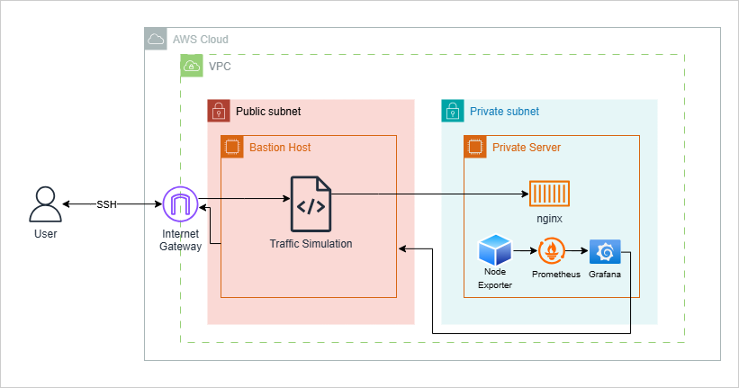

# home-system-boogie

This project is designed to practice my networking and cloud knowledge by creating an at home virtual lab, post passing my CCNA exam and studying for AWS SAA-C03. Concepts used in this project include network and cloud architecture, automation, and monitoring. home-system-boogie will be split into two different phases, highlighting automation in networks simulated in gns3 and monitoring cloud behavior in aws. This project aims to answer the problem of how to host your own simulated network (AWS and GNS3), create network automation scripts (Netmiko), and monitor the system's behavior (Grafana and Prometheus)

#### Tools used:
* GNS3
* Netmiko
* AWS - EC2, VPC
* Terraform
* Prometheus
* Grafana

### Phases
Phase 1: Creating a network

* Setup github repository to track progress of the project and documentation.
* Setup network topology in GNS3. Devices in GNS3 should have the ability to be connected to via SSH so configuration can happen from local PC.
* Confirm connection from GNS3 domain to network on local PC using ping and SSH.
* Use Netmiko to Write automation script to create configuration tasks like VLAN setup, interface setup, etc.

Phase 2: Cloud Networking and monitoring
* Setup cloud infrastructure using Terraform including internet gateway private server, public server, vpc
* Establish docker containers on private server for prometheus, grafana, and node exporter connection
* Create faux traffic to run on bastion host in public subnet. This will be scraped by Prometheus.
* Create panels in Grafana using prometheus as a data source with queries that display metrics like CPU usage, memory usage, network traffic
* After 5 days, observe results and document findings

#### Network Architecture (phase 1)

#### Cloud Architecture (phase 2)

### Results
insert here

### How to run
insert here

### Troubleshooting:

Phase 1:
I was having  trouble trying to ping my local terminal from the router inside GNS3. I tried using every ethernet adapter my computer had to offer but nothing was working. Finally, I followed this guide on the official GNS3 website (https://www.gns3.com/community/support/can-t-ping-local-pc-to-gns3-usin) which instructed me to uninstall ncap and download winpcap 4.1.3. After doing this, I had successful pings and was able to SSH into the terminal on my local machine.

When I put the project down and come back to it, I ping the routers from my terminal to check my connection. Often when it's been a while since I worked on the project and come back, I do not get successful pings. The solution to this was restarting GNS3.

Regular SSH command is not working on my PC terminal, had to add some parameters:
ssh -oKexAlgorithms=+diffie-hellman-group1-sha1 -oHostKeyAlgorithms=+ssh-rsa -oCiphers=+aes128-cbc -oMACs=+hmac-sha1 maya@172.16.10.10

Phase 2:
Since every resource I'm using from AWS is trying to utilize the free tier, it is imperative to tear down the nat gateway after only needing it to let the private instance pull Docker images.

Permission denied (publickey,gssapi-keyex,gssapi-with-mic). = need to add the key to the agent
